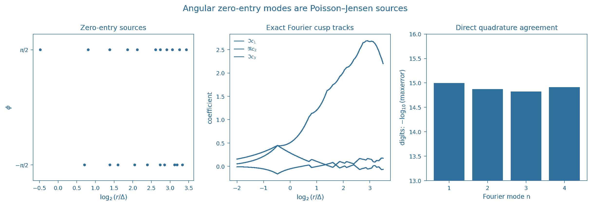

# Angular zero-entry Poisson–Jensen closure

## Question

After `VIS-014` showed that the circular mean of zero-normalized `log|xi|` contains only radial zero-entry distances, do the **nonzero angular Fourier modes** carry an independent multiscale geometry, or are their cross-radius features also forced by classical complex analysis?

## Construction

Use the 100th numerically tabulated critical-line zeta zero as center, with ordinate `gamma_100 = 236.5242296658162`, and normalize local ordinate differences by

`Delta = 2 pi / log(gamma_100/(2 pi)) = 1.7317763761869103`.

For zero indices `k=89,...,112`, excluding `k=100`, set the normalized local positions

`a_k = i (gamma_k-gamma_100)/Delta`

and form the finite zero product

`P(w)=product_k (1-w/a_k)`.

The retained scale window is `0.25 <= r/Delta <= 11.3`. The left panel shows where the translated zeros enter the expanding circles in `(log2 r, phi)` coordinates. The middle panel shows the nontrivial component of the first three angular Fourier coefficients

`c_n(r)=(1/(2 pi)) int log|P(r exp(i theta))| exp(-i n theta) d theta`.

Because the sampled zeros are collinear at angles `+pi/2` and `-pi/2`, odd modes are purely imaginary and even modes are purely real.

For a zero `a=rho exp(i phi)`, its exact contribution is

`-(1/(2n)) exp(-i n phi) exp(-n |log r-log rho|)`.

The right panel summarizes the agreement between this closed form and direct 4096-angle shell quadrature at 79 radii kept away from entry circles.

## Observation

The Fourier trajectories show many sharp cross-scale kinks that could look like a nontrivial angular multiscale hierarchy if viewed only as curves.

They are not. Every kink is located at a zero-entry radius and is exactly the exponential cusp forced by the logarithmic potential of that zero. In log radius `t`, applying `(d^2/dt^2-n^2)` to mode `n` turns the entire trajectory into delta sources whose complex weights are the `n`th angular moments of the entering zeros.

The large smooth accumulation of the even mode is likewise forced by collinearity: upper and lower critical-line zeros contribute the same phase to even modes, while odd modes retain the up/down sign.

## Robustness

The closed-form coefficient identity is analytic and does not depend on interpolation, rendering, or finite angular sampling. The numerical comparison is only an integrity check: across the retained radii the worst absolute direct-quadrature errors are `1.01e-15`, `1.33e-15`, `1.50e-15`, and `1.22e-15` for `n=1,2,3,4`.

The plotted finite product is deliberately not presented as an approximation to `xi`; it isolates the zero-source geometry that Poisson–Jensen identifies exactly. The canonical finding proves the same decomposition for any holomorphic function on a disk after its interior zeros are factored.

The PNG is `2432 x 851` pixels and was validated by a full PNG decode before publication.

## Research consequence

Canonical result: `research/visual_exploration/findings/VIS-015-nonzero-shell-modes-poisson-jensen-zero-sources.md`.

The apparent nonzero-angular circular-shell escape left after `VIS-014` is closed as an independent information channel. For `log|H_rho|`, entered zeros supply explicit angular source terms; subtracting them leaves a zero-free harmonic remainder whose smaller shells are Poisson-determined by one boundary shell.

The accepted multiscale clue should therefore look beyond circular log-modulus texture itself. A surviving target must extract a genuinely non-Poisson-Jensen statistic — for example a nonclassical statistic of the zero configuration against matched controls, a cross-center relation, or another observable whose information is not already equivalent to zero sources plus harmonic boundary data.
