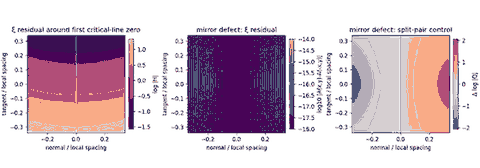

# Exact reflection parity of the Taylor-normalized xi residual

## Question

`VIS-009` showed that reflection fixing forces the first normal derivative of the Taylor-normalized modulus residual to vanish at a critical-line zero. This view asks whether that is merely a first-order fact or whether the anti-holomorphic reflection constrains the complete finite-radius residual.

## Construction

Let `rho = 1/2 + i gamma_1` be the first positive critical-line zero of Riemann's `xi` function, let `Delta = gamma_2-gamma_1 ~= 6.8873144970` be the spacing to the second positive critical-line zero, and put

`H(w) = xi(rho+w)/(xi'(rho) w)`,

with the removable value `H(0)=1`. The left panel renders

`A(x,y)=log|H(Delta(x+i y))|`

on `|x|,|y|<=0.34`, so `x` is the normal direction to the critical line and `y` is the tangent direction, both in local-spacing units.

The middle panel renders the mirror defect

`A(x,y)-A(-x,y)`.

The right panel uses the split-reflection-pair control from `VIS-009`. Around one zero its normalized residual is

`Q(w)=1+w/(2 epsilon)`

with `epsilon/Delta=0.22`, and the panel renders `log|Q(x+i y)|-log|Q(-x+i y)|`.

The PNG was rendered from 50-digit `mpmath` evaluations, then fully decoded and validated with Pillow before publication.

## Observation

The finite-radius xi residual is visibly mirror symmetric across the critical line, while the split-pair control has a large antisymmetric component. The xi mirror-defect panel contains only numerical roundoff.

This is not a newly observed empirical symmetry. The picture led back to the exact identity proved in `VIS-011`: after the zero monomial is divided out, anti-holomorphic reflection fixing gives

`H(-conj(w)) = conj(H(w))`

at every point where the normalized residual is defined.

## Robustness

On the plotted double-precision array, the maximum absolute mirror defect was `2.3e-16`. As a separate 50-digit check, the same identity was sampled on a `5 x 5` spacing-normalized grid around each of the first twelve positive critical-line zeros; the largest absolute defect in `log|H|` was below `7.1e-51`.

The exact proof does not depend on those numerical checks, the first-zero spacing normalization, the colormap, or the chosen window. The split-pair control confirms that the symmetry is tied to the zero being fixed by the reflection rather than to zero multiplicity alone.

## Research consequence

Canonical result: [[research/visual_exploration/findings/VIS-011-taylor-normalized-residual-full-reflection-parity.md]].

The accepted mesoscopic clue [[research/visual_exploration/clues/CLUE-zeta-critical-strip-multiscale-geometry.md]] is narrowed again: any left/right antisymmetric modulus statistic around a critical-line zero is an exact symmetry baseline, not a mesoscopic signal. Future comparisons must quotient this full parity, for example by using the reflection-even component before comparing with off-line controls.