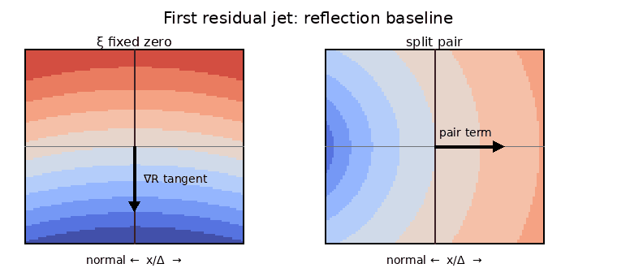

# Critical-line residual gradient as a reflection baseline

## Question

After `VIS-008` removes the universal monomial shape of an isolated zero, can the next visible residual geometry already distinguish a zero fixed by the critical-line reflection from an off-line surrogate? If so, that difference is a potential confound rather than the sought mesoscopic signal.

## Construction

Use Riemann's entire `xi` function

`xi(s) = (1/2) s(s-1) Gamma(s/2) pi^(-s/2) zeta(s)`,

the first positive critical-line zero

`rho ~= 1/2 + 14.1347251417347 i`,

and the spacing to the second positive critical-line zero

`Delta ~= 6.88731449703686`.

The left panel renders the Taylor-residual log modulus

`R_xi(x,y) = log|xi(rho + Delta(x+i y))/(xi'(rho) Delta(x+i y))|`

on the fixed spacing-normalized square `|x|,|y|<=0.34`. The value at the origin is the removable limit `0`. No fitted rotation, adaptive window, or post-hoc parameter search is used.

The right panel uses a minimal reflection-split control. Viewed from one off-line zero, the local symmetric pair factor is

`P_epsilon(w)=w(w+2 epsilon)`,

so after division by the target zero and leading coefficient its residual is exactly

`1+w/(2 epsilon)`.

The panel uses `epsilon/Delta=0.25` on the same normalized square; the reflected companion itself lies just outside the displayed window at `x=-0.5`.

Color encodes the same scalar quantity `log|residual|` in both panels. Contours are overlaid only to make gradient orientation visible.

## Observation

The critical-line `xi` residual is first-order flat in the horizontal direction: near the central zero its contours are approximately horizontal, so the log-modulus gradient points along the critical line. The split-pair control shows the orthogonal behavior, with a strong horizontal first-order gradient produced by the distinct reflected companion.

The contrast is visually striking, but the important fact is that it is **forced by local symmetry**, not evidence of a new zeta geometry.

## Robustness

[[research/visual_exploration/findings/VIS-009-reflection-fixed-zero-residual-gradient.md]] derives the axis constraint exactly for every holomorphic function satisfying reflection-real symmetry across a vertical line and for zeros of arbitrary multiplicity on that fixed line. For a simple `xi` zero it gives

`xi''(rho)/(2 xi'(rho)) in i R`.

A 50-digit numerical check at the first twenty positive critical-line zeros found the real part of this ratio below `1.6e-66` in magnitude, while its imaginary part varied; the exact Taylor/reflection argument, not those values, is the evidence.

The right panel is also exact: its residual is algebraically `1+w/(2 epsilon)`. Changing the colormap or contour levels cannot alter the first-order gradient directions. Changing coordinates can rotate their rendered appearance, so the invariant statement is formulated relative to the normal/tangent splitting of the reflection fixed set.

The PNG was generated to a temporary file, fully decoded with Pillow `Image.verify()` and a reopen/`Image.load()` pass, and hashed before publication. Its publication identity for this artifact is SHA-256 `e81ed85fc0d174b3ee039c54084ca26865e63c8690061d4967d514769a1d57db`.

## Research consequence

This image closes a cheap false-positive route inside the accepted clue [[research/visual_exploration/clues/CLUE-zeta-critical-strip-multiscale-geometry.md]]. An off-line surrogate can look different immediately because reflection fixing changes the first residual jet. Future mesoscopic statistics must therefore remove or match that jet, in addition to removing the universal monomial from `VIS-008`, before any on-line/off-line visual separation is treated as interesting.
