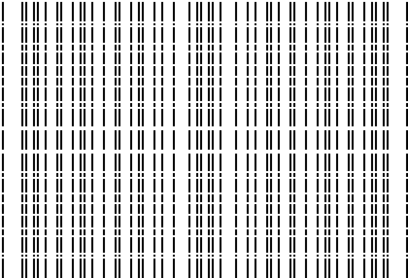

# CRT primorial rank-one carpet

## Question

Can a visually intricate primorial-sieve picture reveal nontrivial prime structure, or can the apparent recursive/block structure be imposed entirely by a mathematically natural coordinate choice?

## Construction

Take `P=30030=210*143` with coprime factors `A=210=2*3*5*7` and `B=143=11*13`. For each pixel `(a,b)`, use the unique CRT residue `n mod P` satisfying `n=a mod 210` and `n=b mod 143`. The pixel is dark exactly when `gcd(n,30030)=1`, so it represents a residue that survives sieving by `2,3,5,7,11,13`.

The horizontal axis is `a mod 210` and the vertical axis is `b mod 143`. There are exactly `phi(210)*phi(143)=48*120=5760` dark cells.

## Visual observation

The image has conspicuous repeated vertical families, horizontal gaps, and rectangular repetition. It looks highly structured and can easily invite a fractal or multiscale interpretation.

In these coordinates, however, the entire image is exactly the outer product of the unit indicator modulo `210` and the unit indicator modulo `143`. The rendered matrix therefore has exact real rank `1`. The visual complexity contains no coupling between the two CRT factors.

## Robustness and controls

The factorization is not numerical coincidence: it holds for every pair of coprime factors `A,B`, and extends to a rank-one tensor for any pairwise coprime CRT decomposition. Independent row/column permutations preserve the rank-one fact while substantially changing the appearance, showing that the texture itself is coordinate-sensitive.

A shuffled mask with the same density is not forced to have rank one, while the actual prime indicator is a strict subset of wheel survivors. This makes the CRT mask a useful null baseline rather than a model of the full prime distribution.

## Research consequence

Treat striking wheel-sieve geometry as construction-induced until a candidate statistic survives conditioning on the CRT product mask. Future visual searches for genuine prime structure should compare actual primes, zero-sensitive quantities, or cross-scale residuals against matched wheel controls rather than interpreting the wheel pattern itself.

Formalized as [[research/visual_exploration/findings/VIS-001-crt-wheel-rank-one-artifact.md]].
