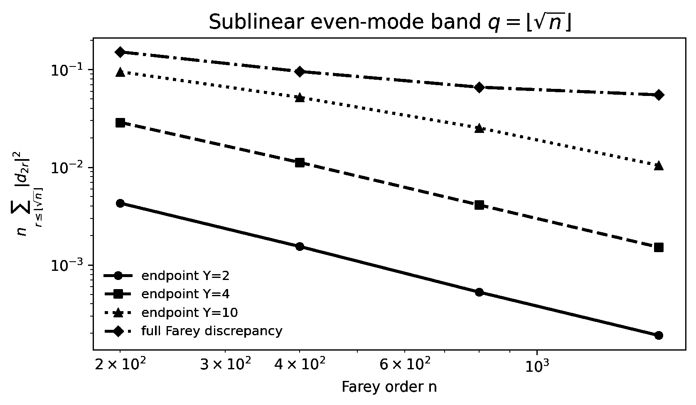

# Farey endpoint layers decouple from sublinear Dirichlet bands

## Question

Can the deterministic fixed-`nx` endpoint layers from `VIS-029` explain a genuinely sublinear even-mode Farey spectrum, or is there a spectral regime where their contribution is provably negligible without subtracting them?

## Construction

For Farey order `n`, let `N=sum_(q<=n) phi(q)`, `D_k=x_k-k/N`, and use the orthonormal Dirichlet sine basis from `VIS-027`. For a fixed endpoint window `Y`, retain `D_k` only at ranks with `x_k<=Y/n` and their Farey reflections, setting the interior to zero. The resulting endpoint component has even coefficients `d_(2r)^(Y)`.

The plot uses the pre-specified sublinear cutoff `q=floor(sqrt(n))`. It shows the exact scaled endpoint energy `n sum_(r<=q)|d_(2r)^(Y)|^2` for fixed `Y=2,4,10` at `n=200,400,800,1600`, together with the same even-mode band of the complete Farey discrepancy at those orders. No exponent is fitted and no continuum approximation is used for the plotted values.

## Observation

For every displayed fixed endpoint window, the square-root-band endpoint energy decreases strongly as Farey order grows. At `Y=10` it falls from about `0.09495` at `n=200` to `0.01045` at `n=1600`. The complete-Farey finite band remains larger at the largest displayed orders, reaching about `0.05507` at `n=1600`.

That finite separation is only a diagnostic. The important feature is that the fixed endpoint component becomes small in exactly the regime predicted by the analytic small-angle bound; no nonzero asymptotic for the complete Farey band is inferred from the picture.

## Robustness

At `n=200,400,800,1600`, the scaled endpoint energies decrease from approximately `0.00429` to `0.000190` for `Y=2`, from `0.02882` to `0.00152` for `Y=4`, and from `0.09495` to `0.01045` for `Y=10`. Thus the visual effect is not tied to one favorable endpoint cutoff.

More importantly, `VIS-031` proves representation-independently that for every fixed `Y`, `|d_(2r)^(Y)|=O_Y(r/n^2)` and hence `n sum_(r<=q_n)|d_(2r)^(Y)|^2 -> 0` whenever `q_n=o(n)`. The conclusion therefore does not depend on the chosen plotted cutoff, resolution, or finite trend.

## Research consequence

The canonical result is [`VIS-031`](../findings/VIS-031-farey-fixed-endpoints-vanish-sublinear-bands.md). It strengthens the cross-line clue [`CLUE-farey-gap-order-bridge-suppression`](../../farey_discrepancy/clues/CLUE-farey-gap-order-bridge-suppression.md): a pre-registered sublinear even-mode band is an endpoint-safe probe for every fixed-`nx` endpoint hierarchy and avoids the arithmetic leakage risk of an endpoint cutoff that grows with `n`.

The image is supporting exploratory context, not mathematical evidence. `VIS-031` supplies the exact bound; whether the **full** Farey sublinear band contains a nontrivial arithmetic signal remains open.
