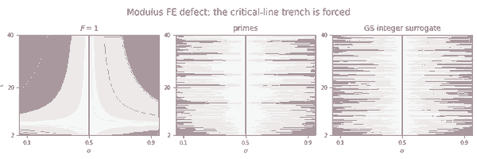

# Forced critical-line trench in a modulus-only functional-equation defect

## Question

`PL-125` shows that Grosswald–Schnitzer Euler-factor deformations can preserve the zeta zero divisor while changing the exact prime geometry, while `PL-126` shows that the full Riemann functional equation inside Hamburger's ordinary Dirichlet-series class is rigid. The visual question was whether a heatmap of **functional-equation failure in modulus** could expose that distinction.

## Construction

Use the standard Riemann functional-equation factor

`chi(s) = pi^(s-1/2) Gamma((1-s)/2) / Gamma(s/2)`

and, wherever all terms are finite and nonzero, define

`A_F(s) = log|F(s)| - log|chi(s) F(1-s)|`.

The image samples `s = sigma + i t` on `0.05 <= sigma <= 0.95` and `2 <= t <= 40` on a `401 x 481` grid. It compares three Schwarz-symmetric inputs:

1. `F(s)=1`, containing no arithmetic at all;
2. the finite Euler product over the first 30 rational primes;
3. the 30-factor integer Grosswald–Schnitzer-style surrogate with `q_1=2` and `q_n=p_n+1` for `n>=2`, beginning `2,4,6,8,12,...`.

For `n>=2`, `p_n < p_n+1 <= p_(n+1)`, so the third panel obeys the Grosswald–Schnitzer interval condition factor by factor. The black line marks `sigma=1/2`. The committed PNG uses a compact quantized palette for repository size; the mathematical zero set and sampled values are unchanged by that rendering step.

## Observation

All three panels have an exact central nodal trench, including the control `F=1`. The prime and deformed Euler products add substantial oscillatory texture, but the visually strongest vertical feature is already present without any Euler factors.

This is not merely a numerical coincidence. Schwarz symmetry and the algebra of `chi` force

`A_F(1-conj(s)) = -A_F(s)`,

so `A_F(1/2+i t)=0` wherever the logarithms are defined, regardless of whether `F` satisfies the Riemann functional equation.

## Robustness

The center column is zero to floating-point precision: the maximum absolute value over the sampled `t` range was below `5e-15` for all three panels. Reflecting the grid across `sigma=1/2` and adding the two halves leaves a maximum absolute residual below `1.5e-14`.

The control is stronger than changing the prime set: `F=1` already has the same critical-line trench. Changing truncation or the admissible real/integer generators cannot remove the forced nodal line as long as `F(conj(s))=conj(F(s))`. A phase-sensitive or complex-valued functional-equation residual is not subject to this particular collapse.

## Research consequence

Canonical negative result: [[research/visual_exploration/findings/VIS-006-modulus-functional-equation-defect-forced-critical-line.md]].

The image therefore cannot support a claim that a central trench detects rational-prime arithmetic, Hamburger rigidity, or RH localization. It instead motivates a phase-sensitive quantitative question for the Prime Lattice line: [[research/prime_lattice/clues/CLUE-quantitative-hamburger-phase-rigidity.md]].
