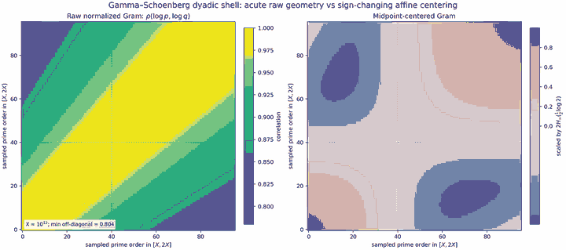

# Gamma–Schoenberg dyadic midpoint centering

## Question

`WP-118` shows that the canonical Gamma–Schoenberg vectors at positive prime frequencies form an acute cone, so the raw shared Hilbert coupling has reinforcing rather than cancelling cross-prime terms. This view asks whether the simplest affine quotient-like operation — subtracting one common vector at the geometric midpoint of each dyadic prime shell — visibly breaks that acuteness, and whether doing so changes the sharp summability boundary.

## Construction

Use the `WP-118` symbol

\[
H_\infty(t)=\operatorname{Re}\psi\!\left(\frac14+\frac{it}{2}\right)-\psi\!\left(\frac14\right)
\]

and its Schoenberg embedding `Φ(t)(y)=e^{ity}-1`, whose real Gram kernel is

\[
K_\infty(s,t)=H_\infty(s)+H_\infty(t)-H_\infty(s-t).
\]

For a dyadic shell `[X,2X]`, put

\[
m_X=\log(\sqrt2 X),\qquad
u_p=\log p-m_X=\log\frac{p}{\sqrt2 X},
\]

and center every prime vector by the same shell midpoint:

\[
\Psi_X(p)=\Phi(\log p)-\Phi(m_X).
\]

The exact identity

\[
\Phi(m+u)-\Phi(m)=e^{imy}(e^{iuy}-1)
\]

shows that common multiplication by `e^{imy}` is unitary and therefore the centered shell Gram depends only on the relative logarithmic coordinates:

\[
\langle\Psi_X(p),\Psi_X(q)\rangle
=H_\infty(u_p)+H_\infty(u_q)-H_\infty(u_p-u_q).
\]

The retained image uses `X=10^12` and `96` deterministic prime samples spread across `[X,2X]`. The left panel is the raw normalized Gram correlation of `Φ(log p)`; the right panel is the centered Gram, scaled by the fixed positive value `2H_\infty((\log 2)/2)` so the sign geometry is directly visible.

## Observation

The raw shell is visually close to a rank-one positive block: every sampled off-diagonal correlation is positive, with minimum about `0.804` and median about `0.959`. After midpoint centering, the geometry changes qualitatively. Same-side pairs remain positive while pairs lying on opposite sides of the geometric midpoint develop negative Gram entries, giving the four-quadrant pattern in the right panel.

The sign change is not only visual. Since `H_\infty(t)=a_2t^2+O(t^4)` near zero with `a_2>0`,

\[
G(\varepsilon,-\varepsilon)
=2H_\infty(\varepsilon)-H_\infty(2\varepsilon)
=-2a_2\varepsilon^2+O(\varepsilon^4)<0
\]

for sufficiently small nonzero `ε`. Thus this affine centering genuinely escapes the raw acute cone locally.

## Robustness

The raw positive-correlation effect was checked at several shell scales and strengthens rather than disappears as the shell moves outward. More importantly, the centered geometry is exactly scale-free: after subtraction of `m_X`, the common unitary factor removes all dependence on `X` except the actual relative positions `p/X`. A dense relative-log grid on `[-(\log 2)/2,(\log 2)/2]` reproduces the same sign-changing quadrant structure, so it is not caused by the finite prime sample or rasterization.

The full checkerboard sign rule on the entire dyadic interval is not asserted here. Only the exact local sign change and the scale-free centered kernel are used mathematically. The associated canonical finding proves separately that this sign freedom still does not improve the shell summability threshold.

## Research consequence

The picture motivated and illustrates [[research/visual_exploration/findings/VIS-004-dyadic-midpoint-centering-keeps-sigma-one-threshold]]. That finding shows that, despite introducing genuine negative cross-prime Gram terms, dyadic midpoint centering leaves the sharp `sigma=1` boundary unchanged. The visualization is supporting exploratory context, not evidence for the asymptotic theorem.
