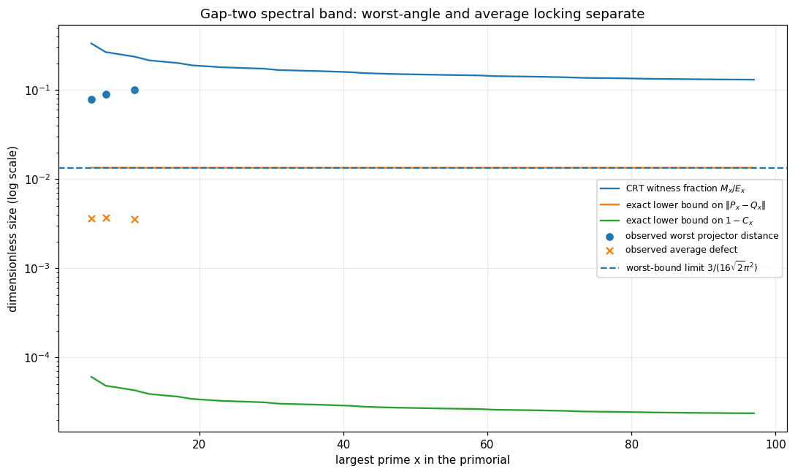

# Gap-two locking: worst-angle obstruction versus average room

## Question

`PC-142` proves that the primitive-shell inverse-square chord Laplacian has an exactly isolated high spectral band whose dimension equals the gap-two matching dimension. The earlier visual experiment showed that this band is almost identical to the gap-two matching space at \(N=30,210,2310\). Does that near-locking become exact asymptotically, and do the worst principal angle and the average/Frobenius overlap behave the same way?

## Construction

For the primorial \(N_x=\prod_{p\le x}p=6m_x\), let \(L_x=L_{N_x}^{\rm int}\), let \(Q_x\) project onto the exact gap-two matching space \(V_x\), and let \(P_x\) project onto the top \(E_x=\prod_{3\le p\le x}(p-2)\) eigenvalues isolated by `PC-142`.

A local CRT witness chooses an oriented gap-two pair with

\[
a\equiv1\pmod2,\qquad a\equiv2\pmod3,\qquad a\equiv1\pmod5,
\]

and excludes \(a\equiv0,-2,4\pmod p\) for every \(p\ge7\) dividing \(N_x\). Then \(a,a+2,a-4\) are primitive while \(a-2,a-6\) are not. Thus \(a-4\) lies outside every gap-two pair but couples to the normalized matching vector \((e_a-e_{a+2})/\sqrt2\) by the exact amount

\[
g_x=\frac{w_4(N_x)-w_6(N_x)}{\sqrt2},
\qquad
w_d(N)=\frac1{4\sin^2(\pi d/N)}.
\]

There are exactly

\[
M_x=\prod_{7\le p\le x}(p-3)
\]

such oriented witnesses. With the `PC-142` norm bound \(D_x=(5m_x^2-1)/6\), the resulting commutator calculation gives the exact curves plotted here:

\[
\|P_x-Q_x\|\ge\frac{g_x}{2D_x},
\]

and, for the normalized capture \(C_x=E_x^{-1}\operatorname{tr}(P_xQ_x)\),

\[
1-C_x\ge
\frac{M_x}{E_x}\frac{g_x^2}{4D_x^2}.
\]

The exact bounds are shown across successive primorial stages through the displayed range. The finite observed points at \(x=5,7,11\) reproduce the earlier dense diagonalizations; they are context, not inputs to the proof.

## Observation

The two notions of locking separate cleanly. The exact lower bound on the worst projector distance approaches the positive constant

\[
\frac{3}{16\sqrt2\,\pi^2}\approx0.01343,
\]

so operator-norm convergence of the top band to the gap-two matching space is impossible even though the finite overlaps look extremely close.

The exact average-defect bound behaves differently. Its witness fraction is

\[
\frac{M_x}{E_x}
=
\frac13\prod_{7\le p\le x}
\left(1-\frac1{p-2}\right)
=
\Theta(1/\log x),
\]

so the certified average defect may decay. This leaves open \(C_x\to1\), but forces \(1-C_x=\Omega(1/\log x)\) from this local witness family. The finite average defects near \(0.0036\) are much larger than the rigorous lower curve, indicating that the single CRT motif captures only part of the observed rotation.

## Robustness

The quantities are basis-invariant: they use orthogonal projectors, principal-angle/operator distance, and normalized Frobenius overlap rather than individual eigenvectors. The lower bounds are exact consequences of CRT membership, two inverse-square chord weights, a commutator identity, and the already proved `PC-142` norm estimate; changing plot scale, resolution, or styling cannot change them.

The visual comparison deliberately keeps the finite diagonalizations separate from the theorem curves. No asymptotic statement is inferred from the three observed samples. The average \(\Theta(1/\log x)\) factor uses the classical Mertens reciprocal-prime asymptotic; the positive worst-angle constant comes directly from the small-angle limits of \(w_4\), \(w_6\), and \(D_x\).

## Research consequence

The exact result is persisted as
[[research/visual_exploration/findings/VIS-005-gap-two-local-leakage-obstructs-uniform-eigenspace-locking.md]].

It resolves the strongest interpretation of the accepted Prime-Circle spectral-locking clue negatively: the isolated top band cannot converge to the gap-two matching space in worst principal angle. The average/Frobenius question survives, but now with a logarithmic lower rate floor. The next useful visual target is therefore not another scalar overlap at larger \(N\), but the **distribution of principal angles conditioned on local CRT constellations**, with the known short-chord leakage factored out before looking for a genuinely nonlocal residual.
