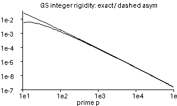

# Monotone Grosswald–Schnitzer integer rigidity profile

## Question

`PL-127` turns the critical-line reflection phase into an additive rigidity diagnostic for Grosswald–Schnitzer deformations. For integer generators it defines the low-scale certificate through

`delta(X) = min_{p prime, p<=X} [g(p)-g(p+1)]`,

where `g(x)=log(x)/(sqrt(x)-1)`.

The visual question was whether this minimum hides irregular prime-scale dips, or whether the individual one-step thresholds lie on a simple monotone resolution profile that can be formalized.

## Construction

Define

`h(x)=g(x)-g(x+1)`.

The retained compact image plots the exact values `h(p)` at primes `11<=p<=100000` on logarithmic axes. It also overlays the large-`p` asymptotic from `PL-127`,

`((1/2)log p - 1) p^(-3/2)`,

using a dashed stroke. No smoothing or fitted envelope is applied. The first few primes are omitted because the leading asymptotic coefficient changes sign below the range where it is a useful approximation; the exact `h(p)` remains positive there.

The repository PNG is deliberately monochrome and compact because no color carries mathematical information: solid versus dashed strokes distinguish the exact threshold from the asymptotic.

## Observation

The exact prime thresholds form a smooth, strictly descending curve. No local prime-gap-induced dips or reversals appear. The asymptotic approaches the exact profile rapidly as the prime scale grows.

This suggests that the minimization in `delta(X)` may be artificial: the weakest detectable one-step integer deformation below a cutoff appears always to occur at the largest prime below that cutoff.

## Robustness

The visual impression is replaced by an exact control in [[research/visual_exploration/findings/VIS-007-grosswald-schnitzer-rigidity-profile-monotone.md]]. That finding proves `g''(x)>0` for every `x>1`. Since `g` is also strictly decreasing, `h(x)>0` and

`h'(x)=g'(x)-g'(x+1)<0`.

Thus monotonicity holds on the entire real interval, not just on the displayed primes. As a numerical audit, `h(p)` was additionally evaluated at every prime through `200000` and was strictly decreasing throughout.

The exact published PNG bytes passed a complete Pillow decode check using `Image.verify()`, followed by reopen and `Image.load()`.

## Research consequence

The image led to the exact refinement [[research/visual_exploration/findings/VIS-007-grosswald-schnitzer-rigidity-profile-monotone.md]]: if `P_X` is the largest prime not exceeding `X`, then the `PL-127` cutoff is exactly `delta(X)=g(P_X)-g(P_X+1)`.

The scalar threshold still does not recover the complete deformation pattern. That residual question is handed to Prime Lattice in [[research/prime_lattice/clues/CLUE-grosswald-schnitzer-phase-fingerprint.md]].