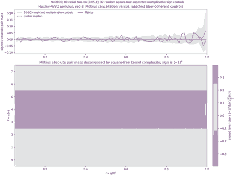

# Huxley–Watt annulus kernel layers

## Question

MC-033 proves that the Huxley–Watt annular coefficient has no cancellation inside a fixed product fiber: for `q = a b^2` with square-free coprime `a,b`, its sign is `mu(a)` and its magnitude is the central-divisor count `R_N(a,b)`. This view asks whether the remaining cross-fiber cancellation already becomes visually special after resolving the annulus by the square-free-kernel complexity `k = omega(a)`, or whether that apparent layer cancellation is also generic under matched multiplicative controls.

## Construction

For a nonzero ordered pair `(m,n)` with `m,n <= N` and both square-free, put

`b = gcd(m,n)`, `a = mn/b^2`, `q = mn`, and `k = omega(a)`.

Then `a,b` are square-free and coprime, and `mu(m)mu(n) = mu(a) = (-1)^k`. Because MC-033 shows that all nonzero pairs in one product fiber have this same sign, counting these ordered pairs exactly reproduces the absolute product-fiber mass `R_N(a,b)` after grouping.

The horizontal coordinate is the intrinsic annular radius `r = q/N^2`. The figure uses `N = 2000`, 80 equal bins on `0.05 <= r <= 1`, and omits the deeper interior only to keep the outer-annulus structure legible.

The lower panel shows, in each radial bin, the fraction of absolute ordered-pair mass carried by each `k`, multiplied by its Möbius sign `(-1)^k`.

The upper panel sums all layers and plots signed mass divided by absolute mass. As a matched control, 32 independent multiplicative functions were generated with the same square-free support and independent prime signs `f(p) in {-1,+1}` (seed `20260903`), extended multiplicatively on square-free integers and set to zero otherwise. These controls preserve exactly the product-fiber sign coherence identified by MC-033. The band is their 10th–90th percentile and the thin curve their median.

There is also an exact geometric rewriting of the MC-033 central-divisor count. If `a = product_j p_j` and a divisor `d|a` is encoded by signs `epsilon_j in {-1,+1}`, then

`2 log(d/sqrt(a)) = sum_j epsilon_j log p_j`.

Since MC-033 uses `T=N/b`, its interval `a/T <= d <= T` becomes

`|sum_j epsilon_j log p_j| <= log(N^2/q) = -log r`.

Thus `R_N(a,b)` counts vertices of a prime-log weighted hypercube inside a central slab whose width depends only on the radial coordinate `r`.

## Observation

The lower panel makes the Möbius sign alternation unusually transparent: at this finite scale most absolute annular mass lies in the adjacent `k=3,4,5` layers, with weighted mean shares about 31.5%, 36.5%, and 18.2% respectively. Their alternating signs nearly cancel in every broad radial region.

That visual cancellation is not, by itself, Möbius-specific. The Möbius signed/absolute ratio lies inside the 10th–90th percentile envelope of the matched multiplicative controls in 66 of the 80 displayed bins (82.5%, close to the nominal 80% coverage), and its largest absolute bin ratio is about 0.052. No persistent radial separation from the controls is visible here.

The prime-log slab rewriting nevertheless exposes a more structured remaining variable than raw `k`: at fixed `r`, the weight is the number of signed log-prime subset sums falling into the shrinking interval `[-log(1/r), log(1/r)]`, while the reciprocal Fourier phase in MC-033 is also radial, `sin(2 pi h/r)`.

## Robustness

The top-panel comparison uses controls that keep square-free support, multiplicativity, and exact same-sign product fibers, so the negative result is not caused by replacing the arithmetic object with independent pair signs. Rebinning changes individual outermost bins, where sample counts are smallest, but not the qualitative fact that the phase-free radial Möbius ratio fluctuates within the matched-control scale.

The lower-panel bands are not a rendering artifact: `k=omega(a)` and the sign `(-1)^k` are exact arithmetic coordinates. Their apparent cancellation is therefore real for this finite statistic, but the control experiment shows that its visual salience is not evidence of a rational-prime-specific mechanism.

No asymptotic conclusion is inferred from `N=2000`, and the omitted `r<0.05` region was not used to claim a global law.

## Research consequence

The simple hypothesis that **radial kernel-complexity layering alone** explains useful Möbius cancellation is not supported by this control. The surviving visual question is more specific: whether the reciprocal phase couples non-generically to the prime-log central-slab geometry, rather than merely to `omega(a)` or to product-fiber coherence.

This is handed to Möbius Cancellation as [[research/mobius_cancellation/clues/CLUE-reciprocal-phase-prime-log-slab-coupling]]. The finite image is motivation and a negative control, not evidence of a power saving or an RH-scale estimate.
