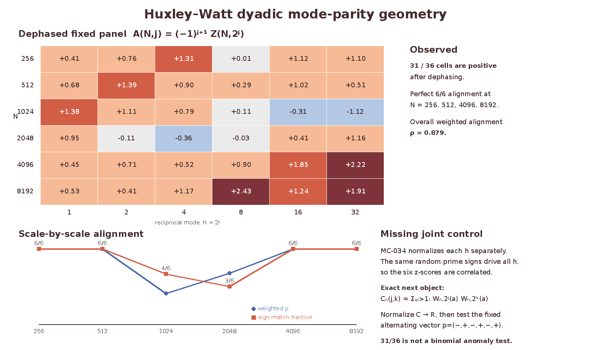

# Huxley–Watt dyadic mode-parity geometry

## Question

GitHub issue #105 found no scalar anomaly in the fixed Möbius/Huxley panel: all standardized values satisfy `|Z| <= 2.429`. This view asks a different, deliberately joint question: does the signed `6 x 6` reciprocal-mode panel contain a stable mode/scale relation that the scalar maximum discards?

## Construction

Use exactly the validated #105 values at `N in {256,512,1024,2048,4096,8192}` and reciprocal modes `h=2^j` for `j=0,...,5`, with no new scales, kernels, interpolation, fitting, or recomputation. Let `Z_(N,j)` be the reported standardized Möbius value and define the visually suggested alternating dyadic template

`p_j = (-1)^(j+1) = (-,+,-,+,-,+)`

and the dephased panel

`A_(N,j) = p_j Z_(N,j)`.

The figure renders `A` rather than hiding the sign relation in a categorical overlay. For each scale it also reports the signed-alignment ratio

`rho_N = [sum_j p_j Z_(N,j)] / [sum_j |Z_(N,j)|]`.

The PNG is a direct rendering of the fixed numeric table. The local artifact was fully decoded with Pillow at `1600 x 950`; its SHA-256 before publication is `501975498eb0a55e8ae22bcd349b39e0232421c7dd24580387782f41d42d9ecd`.

## Observation

After dephasing, `31/36` cells are positive. The per-mode sign-match counts are `[6,5,5,5,5,5]` out of six scales, while the per-scale counts are `[6,6,4,3,6,6]` out of six modes. The aggregate signed-alignment ratio is `rho = 0.878882`, and the scale-wise ratios are approximately `[1.000,1.000,0.408,0.673,1.000,1.000]`.

The geometry is therefore not just one large endpoint cell: the same alternating sign template is present across every reciprocal mode and is exact at four of the six sampled scales. However, the template was noticed after inspecting this finite panel, so these counts are descriptive rather than a pre-registered significance test.

## Robustness

Deleting any one scale leaves `25` to `28` matches among the remaining `30` cells and an aggregate alignment between `0.840` and `0.963`. Deleting any one reciprocal mode leaves `25` to `26` matches among `30` cells and alignment between `0.859` and `0.932`. Magnitude-only rendering destroys the relation, while the positive, smoothly declining `sigma/(N log^2 N)` scale diagnostic cannot itself generate the alternating signs.

The main unresolved control is mathematical rather than graphical. `MC-034` normalizes each kernel separately, but the same random prime-sign assignment drives all kernels, so the standardized columns are not independent. An independent-binomial interpretation of `31/36` would therefore be invalid. The exact missing object is the cross-kernel covariance induced by the `W_(N,K)(a)` coefficient vectors.

## Research consequence

No finding is promoted from this picture. The representation-independent follow-up is handed to the Möbius line as [[research/mobius_cancellation/clues/CLUE-dyadic-mode-parity-covariance.md]]. Its decisive test is to compute the exact matched-control cross-kernel covariance on this same fixed panel and ask whether the apparent alternating dyadic template remains unusual after the joint normalization.

Source clue: [[research/visual_exploration/clues/CLUE-mobius-huxley-zscore-scale-geometry.md]]. Source mathematics: [[research/mobius_cancellation/findings/MC-033-annular-product-fiber-sign-coherence.md]] and [[research/mobius_cancellation/findings/MC-034-random-multiplicative-annulus-critical-rms.md]].
