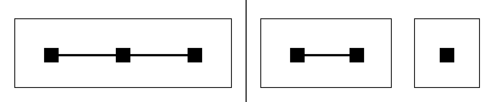

# Overlap-cover phase gluing

## Question

After `VIS-016` shows that the zero multiset plus full boundary modulus determines a holomorphic field on one regular disk up to one unimodular constant, can several centers create independent phase relations that survive as a new visual channel?

## Construction

Represent each local measurement window by an open disk `D_j`. On every disk, `VIS-016` reconstructs the local field up to a phase factor `exp(i alpha_j)`.

Build the overlap graph by joining two disks whenever they intersect. On an overlap, both local reconstructions represent the same holomorphic field, so their unimodular constants must agree at every nonzero point of the overlap. Because zeros of a nonzero holomorphic function are isolated, a nonempty disk overlap always contains such a point.

The left panel depicts one connected three-vertex overlap component. The right panel depicts two overlap components: `D1,D2` form one component and `D3` is isolated. The boxes mark graph components rather than geometric disk boundaries.

## Observation

Connectivity, not the number of centers, controls the remaining local phase freedom. A connected family of overlapping disks has one global phase. A cover with `k` disconnected overlap components has `k` unresolved local phases unless additional analytic information connects those components.

The visible synchronization is therefore not an empirical xi pattern; it is forced by holomorphic uniqueness.

## Robustness

The conclusion is representation-independent. Moving, resizing, or reordering the disks changes the result only when it changes the overlap graph's connected components. The argument does not use a special zeta zero, numerical sampling, colormap, or rendering choice.

The boundary-nonvanishing and full-boundary-modulus hypotheses are inherited from `VIS-016`. Sparse boundary samples, rough Hardy-space boundary data, or disconnected islands with an external bridge require separate analysis.

## Research consequence

Canonical result: `research/visual_exploration/findings/VIS-017-overlap-connectivity-collapses-local-phase-freedom.md`.

Overlapping multi-center phase or domain-coloring portraits do not provide an independent cross-center carrier after the local zero sets and boundary moduli are retained. A surviving cross-center visual program must use zero-configuration statistics, incomplete measurements, separated-region bridges, or another observable not fixed by this gluing argument.
