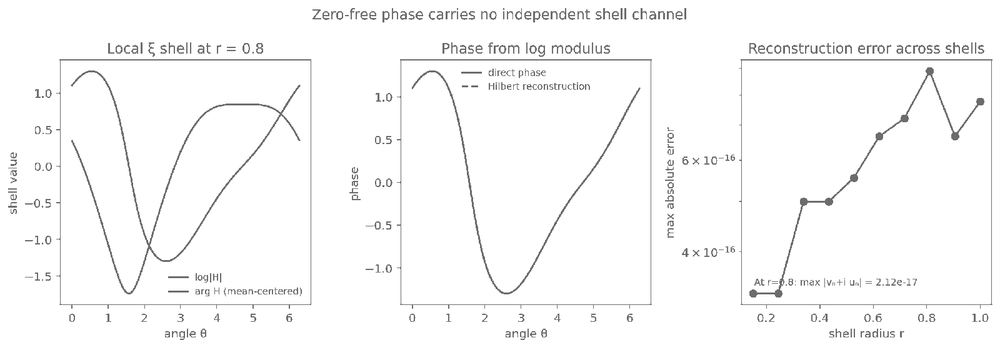

# Phase–log-modulus conjugacy on a local xi shell

## Question

After `VIS-015` closed the complete concentric circular `log|F|` channel as zero sources plus harmonic boundary data, can phase supply an independent visual channel on the same disk?

## Construction

Use the numerically tabulated 100th critical-line zeta zero

`rho_100 = 1/2 + i gamma_100`,
`gamma_100 = 236.5242296658162058...`

and, for illustration only, evaluate

`H(w)=xi(rho_100+w)/(xi'(rho_100) w)`.

On the displayed circle `r=0.8`, evaluate 1024 equally spaced angles and form

`u(theta)=log|H(r e^{i theta})|`

together with the unwrapped numerical phase `v(theta)`, centered to have zero angular mean.

For a zero-free holomorphic quotient, `log H=u+i v` is holomorphic and the nonconstant Fourier modes obey the circular harmonic-conjugate relation

`v_n = -i u_n` for `n>0`.

The middle panel reconstructs `v` from `u` using the Fourier multiplier `-i sign(n)`. The right panel repeats the reconstruction at ten radii from `0.15` to `1.0`, using 512 angles per radius.

## Observation

The direct phase and the phase reconstructed from the log modulus are visually indistinguishable. The apparent phase texture is therefore not a second shell signal in this zero-free analytic quotient; it is the harmonic conjugate of the log-modulus texture.

For the sampled data, the largest absolute reconstruction discrepancy across the ten radii is `8.88e-16`. At `r=0.8`, the largest positive-mode discrepancy in `v_n=-i u_n` over modes `1..12` is `2.12e-17`.

## Robustness

The mathematical relation does not depend on the numerical xi illustration. If `Q` is any zero-free holomorphic function on a simply connected disk, a holomorphic logarithm exists and its imaginary part is the harmonic conjugate of `log|Q|`, unique up to an additive constant.

The numerical shell is only a consistency check. It does not certify a zero-free region for `xi`, does not test RH, and is not used as evidence for the canonical result.

The retained PNG is `1600 x 558` pixels and was fully decoded after rendering. Its pre-publication SHA-256 digest is `d3d29ab537f1810609b58bc9e7f3a338261e823043afbc710f88c0991196707f`.

## Research consequence

Canonical result: `research/visual_exploration/findings/VIS-016-phase-modulus-boundary-uniqueness.md`.

Combined with `VIS-015`, the regular concentric-disk field is completely controlled by the interior zero configuration and one boundary modulus, up to a single global phase. Domain-coloring hue, unwrapped phase, or phase-gradient texture on the same disk therefore cannot be promoted as an independent residual unless the proposed statistic first escapes that exact reconstruction.
