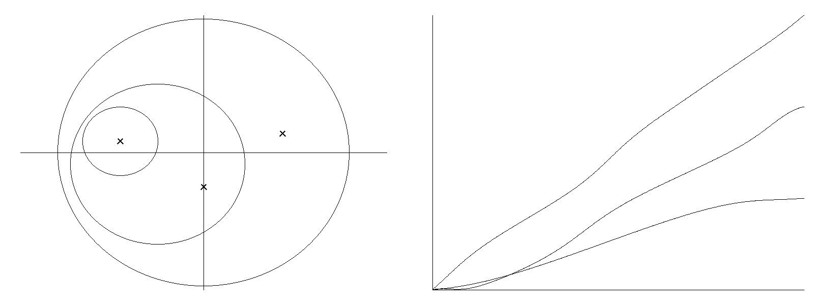

# Phase winding and divisor count

## Question

Can contour phase winding or domain-coloring vortex charge provide an independent visual invariant once the zero configuration is already retained?

## Construction

Use the explicit entire control

`F(z) = (z-z_1)(z-z_2)(z-z_3)`

with simple zeros `z_1=-1+0.15 i`, `z_2=-0.45 i`, and `z_3=0.95+0.25 i`.

The left panel shows three positively oriented circles enclosing exactly one, two, and three zeros. The right panel samples 800 equally spaced contour parameters, evaluates the polynomial, unwraps `arg F`, and plots cumulative phase change divided by `2 pi`. The three endpoints are exactly one, two, and three turns up to floating-point roundoff.

This polynomial is deliberately a universal analytic control rather than zeta data.

## Observation

The visually striking phase circulation is exactly the enclosed divisor count. The image makes the winding visible, but the durable statement is independent of the rendering and is recorded in `VIS-018`.

## Robustness

The integer winding is unchanged by increasing sampling density or continuously deforming a contour without crossing a zero. Crossing one simple zero changes the winding by one; a zero of multiplicity `m` contributes `m`.

That robustness is therefore classical topological bookkeeping of the divisor, not a source-specific zeta signature.

## Research consequence

See `../findings/VIS-018-phase-winding-is-divisor-count.md`.

For the accepted critical-strip multiscale clue, contour hue winding and local vortex charge are closed as independent channels when the divisor is already known. A surviving phase-oriented candidate must retain information beyond winding/multiplicity, or deliberately discard data in a way whose missing information is explicit and testable.
