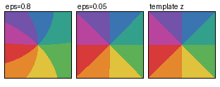

# Local zeta zero portraits collapse to the universal Taylor template

## Question

The proposed critical-strip multiscale clue asks whether nested views around zeta zeros can expose a stable geometric signature. Before interpreting any apparent self-similarity, the first control is the infinitesimal analytic baseline: does a sufficiently deep zoom retain zeta-specific geometry at all?

## Construction

For the numerical illustration, take the first nontrivial critical-line zero

`rho ~= 1/2 + 14.1347251417347 i`

and numerically evaluate `zeta'(rho)`. For a simple-zero zoom define

`G_epsilon(z) = zeta(rho + epsilon z)/(epsilon zeta'(rho))`.

The retained compact PNG compares phase-sector portraits of `G_epsilon` on the same square `-1<=Re(z),Im(z)<=1` at `epsilon=0.8` and `epsilon=0.05` with the universal simple-zero template `z`. Eight phase sectors are mapped to fixed colors; no smoothing, fitted geometry, or adaptive window is used. The color boundaries therefore show only phase organization, which makes the collapse toward the local winding template easy to compare without introducing modulus-dependent decoration.

The exact theorem in `VIS-008` uses no simple-zero assumption globally: for a zero of multiplicity `m`, the corresponding normalized template is `z^m`.

## Observation

At `epsilon=0.8`, the phase boundaries are visibly curved by zeta-specific higher Taylor terms. By `epsilon=0.05`, they are already close to the straight radial sectors of `z`. A separate numerical residual audit gives approximately linear decay in `epsilon`.

This is visually strong but, by itself, would be only a rendering observation. The important question is whether the collapse is forced analytically.

## Robustness

[[research/visual_exploration/findings/VIS-008-infinitesimal-zero-portraits-universal.md]] proves the collapse exactly. For a holomorphic function with a zero of order `m`, Taylor factorization gives

`f(rho+r z)/(a_m r^m) = z^m h(rz)` with `h(0)=1`,

so the normalized portrait converges uniformly to `z^m` on every fixed compact set at `O(r)`. The same statement controls modulus and phase away from the origin. This removes dependence on zeta numerics, the chosen zero, palette, and raster resolution as explanations for the limiting shape.

The retained PNG was fully decoded locally with Pillow `Image.verify()` and a reopen/`Image.load()` pass before publication. Its exact Git blob is verified again before and after advancing `main` under the visual publication gate.

## Research consequence

The picture exposes a **negative baseline**, not evidence for fractality: infinitesimal normalized zero portraits are universal up to multiplicity. The local clue [[research/visual_exploration/clues/CLUE-zeta-critical-strip-multiscale-geometry.md]] is therefore narrowed to mesoscopic or cross-zero geometry after the universal Taylor template is removed.
