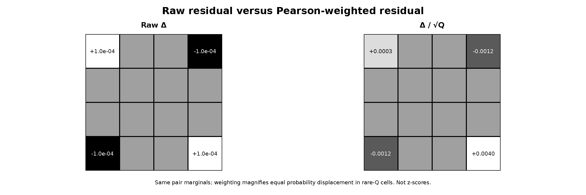

# Three-gap residual whitening geometry

## Question

For the accepted three-gap conditional-residual experiment, does a raw heatmap of

`Delta = P_3-Q`

represent the same geometry as the local likelihood/information distance `D(P_3||Q)`?

## Construction

Fix one middle-state fiber with mass `P(Y=j)=0.25` and conditional marginals

`P(X|j) = (0.55, 0.25, 0.15, 0.05)`

and

`P(Z|j) = (0.60, 0.20, 0.15, 0.05)`.

The Markov closure on this slice is

`Q_j = 0.25 P(X|j) P(Z|j)`.

Add the pair-marginal-preserving checkerboard perturbation `epsilon=10^-4` on rows/columns `{0,3}`:

`(+epsilon, -epsilon; -epsilon, +epsilon)`.

Every row sum and column sum of `Delta_j` remains zero, so the adjacent pair marginals are unchanged. The left panel renders raw `Delta_j`. The right panel renders the Pearson-weighted coordinates

`W_j = Delta_j / sqrt(Q_j)`.

## Observation

All four nonzero raw residual cells have the same absolute probability displacement `10^-4`. They are therefore equally salient in the raw view.

They are not equally important in local KL geometry. The largest-baseline corner has `Q_00=0.0825`, giving `W_00≈+0.000348`, while the rare corner has `Q_33=0.000625`, giving `W_33=+0.004`. The same absolute displacement is therefore about 11.5 times larger in the Pearson coordinate at the rare corner.

For this finite perturbation,

`D(P||Q) ≈ 9.07e-6`

while the quadratic approximation

`(1/2) sum Delta^2/Q ≈ 9.45e-6`.

The numerical agreement is illustrative only; the exact local expansion is derived independently in `VIS-024`.

## Robustness

The checkerboard is chosen because pair-marginal preservation is exact, not because it produces an attractive pattern. Reordering bins permutes both images without changing the norm or the dimension of the residual subspace.

Changing the marginal probabilities changes the visual contrast in the weighted panel exactly through `Q^-1/2`; that dependence is the point of the control. It shows why a raw residual heatmap can visually understate rare-cell contributions, while a Pearson-weighted heatmap can become unstable when expected cells are too small.

Neither panel supplies cellwise statistical significance. The weighted entries remain constrained and correlated, and an empirical `Q_hat` is fitted from the same sequence.

## Research consequence

For a retained zeta-versus-CUE three-gap residual, show raw probability displacement and a likelihood-aware weighting separately rather than treating one heatmap as canonical. Keep the binning fixed across processes, report occupancy, and use process-level covariance/resampling before attaching significance to individual cells.

Suggested outcome: finding-backed visualization control. The exact mathematical content is persisted in `VIS-024`; this synthetic image is not evidence for a zeta-specific effect.
