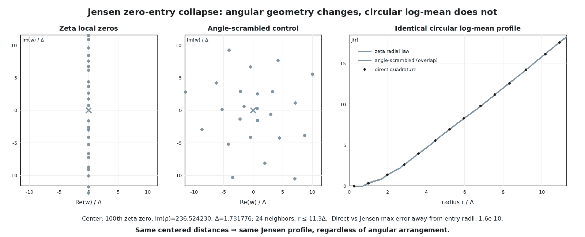

# Jensen radial collapse at zero-entry scales

## Question

Does the first genuinely non-zero-free multiscale observable suggested by the accepted critical-strip geometry clue — the circular mean of the normalized log modulus as neighboring zeros enter a centered disk — retain geometric information beyond ordinary zero-entry radii?

## Construction

The center is the 100th nontrivial zeta zero returned at high precision, with `Im(rho)=236.524229665816...`. Distances are normalized by the local mean-spacing scale

`Delta = 2 pi / log(Im(rho)/(2 pi)) = 1.731776376187...`.

The plotted local set contains the 12 preceding and 12 following critical-line zeros. The radial window is `r<=11.3 Delta`; the first omitted upper and lower neighbors are at approximately `12.7535 Delta` and `13.3830 Delta`, so every zero capable of entering a plotted disk is represented.

The left panel plots the translated zeta-zero positions `a_j=rho_j-rho`. The middle panel preserves every radius `|a_j|` but replaces its angle deterministically by

`phi_n = 0.37 + n pi (3-sqrt(5)) mod 2 pi`

after sorting by radius. This deliberately destroys the angular geometry while retaining the complete radial-distance multiset.

For both configurations, the right panel uses the normalized finite product

`P(w)=prod_j (1-w/a_j)`, with `P(0)=1`,

and compares direct 4096-angle quadrature of

`(1/(2 pi)) int log|P(r e^{i theta})| d theta`

against the exact Jensen profile

`J(r)=sum_{|a_j|<r} log(r/|a_j|)`.

## Observation

The actual local zeros are collinear while the control is spread around the plane, yet their circular log-mean profiles lie exactly on top of one another. The visible kinks occur only when a preserved radial distance crosses the expanding circle.

This is not merely a numerical coincidence: Jensen's formula contains the zero moduli but no angular coordinates. In log-radius coordinates the profile is a sum of hinge functions, so its slope is just the number of enclosed zeros.

## Robustness

The control preserves **all** entry radii, not just a gap mean or pair-correlation summary, while maximally perturbing the angles. The identity therefore survives arbitrary angular rearrangement, not only the particular deterministic scramble shown.

On sampled radii separated from entry circles, direct circular quadrature agrees with the exact Jensen profile to at worst about `1.6e-10`; the direct actual-versus-scrambled discrepancy is below `4.8e-11`. Changing quadrature density or the deterministic angle scramble changes only numerical error, not the exact radial law.

The image is a finite integrity check. The result does not depend on the rendering, on the 100th zero, or on RH.

## Research consequence

Canonical finding: `../findings/VIS-014-circular-zero-entry-logmeans-radial-only.md`.

The accepted clue `../clues/CLUE-zeta-critical-strip-multiscale-geometry.md` should no longer treat a radially averaged zero-entry staircase as a candidate mesoscopic invariant. The surviving visual search must retain information removed by the circular average, especially nonzero angular modes, multi-zero angular organization, non-circular domains, or cross-center structure after explicit Jensen/Poisson-Jensen baselines are removed.
